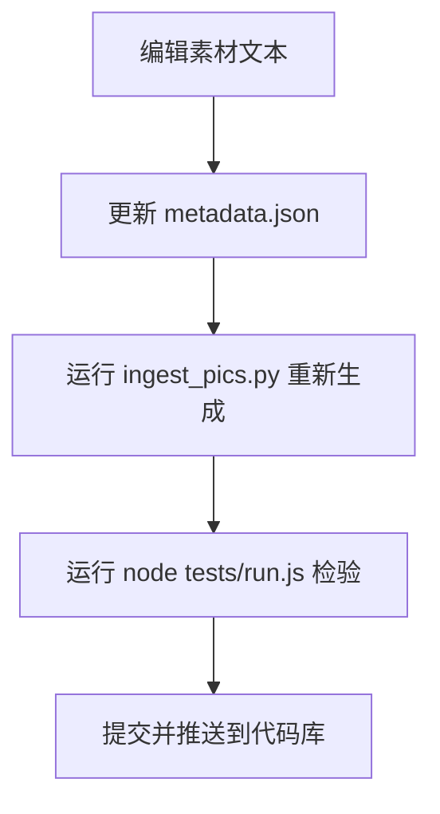

# 项目交接与开发指南 (Handover & Architecture Guide)

本文档整理了 **CRIG Ontdekt: AI or Not?** 项目的核心架构、文件组织、数据处理管线、关键逻辑与日常维护流程，供后续开发、维护和内容更新快速查阅，避免反复检索文件结构。

---

## 1. 项目简介与运行方式

* **项目定位**：根特大学 / 根特大学癌症研究所 (CRIG) 科普外展活动互动游戏。玩家通过对比两张显微镜照片或实验场景图片，分辨哪张是真实照片，哪张是 AI 生成，并在每题作答后查看具体的破绽解析。
* **支持模式**：
  * **Kiosk 触屏机模式**：无人值守自动轮播 Attract 屏幕，超时自动重置会话，大尺寸触摸优化。
  * **Web 浏览器模式**：网页端交互，自适应各屏幕分辨率。
* **双语支持**：荷兰语 (NL，默认) 与 英语 (ENG)。
* **本地运行**：
  * `serve.bat`：使用 Python 内置简易 HTTP 服务器托管当前目录。
  * `kiosk.bat`：以 Chrome/Edge 全屏 Kiosk 模式启动。
  * 或者直接使用任何本地静态服务器打开 `index.html`。
* **测试套件**：
  * 命令行单元测试：`node tests/run.js`（覆盖 manifest、评分、状态机、选择器、校验等 172+ 项测试）。
  * 浏览器端 DOM 测试：在浏览器中打开 `tests/run.html`。

---

## 2. 核心目录与文件结构

```text
ai-or-not/
├── index.html                 # 主入口：结构包含 HUD、双卡图片容器、答题解释弹窗 (notePopup)
├── CHANGELOG.md               # 历史变更记录
├── DESIGN.md                  # 设计规范文档（视觉风格、交互规范与防作弊原则）
├── HANDOVER.md                # [本文档] 项目架构与交接指南
│
├── assets/                    # 静态资源
│   ├── img/
│   │   ├── crig-logo.webp     # CRIG 品牌 Logo
│   │   └── p/                 # 运行时图片池（p001 ~ p012）
│   │       ├── p001/          # 每道题分配独立中性目录
│   │       │   ├── 1.webp     # 槽位 1 图片（可能是 AI 也可能是真实，随机打乱）
│   │       │   └── 2.webp     # 槽位 2 图片
│   │       └── ...
│
├── data/                      # 数据与题库
│   ├── pics/                  # ★ 题库唯一原始素材源（Single Source of Truth）
│   │   ├── metadata.json      # 题目元数据配置（线索类型、标题、指示区域、可选的 rule 规律等）
│   │   ├── Level1/ ~ Level6/  # 6 个难度等级素材目录
│   │   │   ├── <Key>_AI.<ext> # AI 生成图片 (.png, .jpg, .jpeg)
│   │   │   ├── <Key>_Real.<ext># 真实拍摄图片
│   │   │   └── <Key>_annot.txt # 题目的 NL/ENG 详细解析文本 (NL: ... ENG: ...)
│   ├── manifest.js            # ★ 运行时生成的题库（由 tools/ingest_pics.py 自动生成）
│   ├── crops.json             # 运行时裁切与黑底留白补齐参数
│   ├── compose.js             # 运行期数据集组合器（合并题库并向主逻辑提供接口）
│   └── pairs.csv              # [历史遗留] 早期 7 题原型的 CSV，当前已完全由 pics/ 替代
│
├── js/                        # 游戏核心逻辑（严格按依赖顺序在 index.html 中加载）
│   ├── config.js              # 全局配置（倒计时、难度梯度、进阶关卡配置）
│   ├── util.js                # 基础辅助函数（DOM 操作、随机数、文本工具）
│   ├── difficulty.js          # 难度三轴计算（tells、subject、postprocessing）
│   ├── i18n.js                # 双语字典 (NL / ENG)
│   ├── scoring.js             # 计分算法（平权阶梯计分、连击加成、终局评级）
│   ├── machine.js             # 游戏主状态机 (boot -> ready -> playing -> reveal -> ended)
│   ├── validate.js            # 题目质量校验关卡（进题池前过滤不合规数据）
│   ├── selector.js            # 题目调度与关卡抽选算法
│   ├── placeholder.js         # 占位图生成器（生产环境默认禁用，仅测试/演示用）
│   ├── modes.js               # 模式聚合逻辑（Web / Kiosk 切换）
│   ├── answer-reveal.js       # 揭晓动效、插槽判定与正确/错误逻辑
│   ├── sound.js               # Web Audio API 合成音效
│   ├── zoom.js / loupe.js     # 图片高倍放大镜与局部探查
│   ├── kiosk.js               # Kiosk 模式闲置超时与吸引屏 (Attract Screen)
│   ├── deck-manager.js        # 开发者调试与牌组管理
│   ├── ui.js                  # 界面渲染、弹窗控制 (showNotePopup)、计时器
│   └── main.js                # 入口主流程控制
│
├── css/                       # 样式文件
│   ├── main.css               # 主局布局与色彩主题
│   ├── components.css         # UI 组件（解释卡片、按钮、Badge、弹窗等）
│   └── kiosk.css              # 大屏触控与全屏专用样式
│
├── tests/                     # 自动化测试
│   ├── run.js                 # Node.js 测试启动器
│   ├── run.html               # 浏览器端测试界面
│   └── test.*.js              # 各模块专项单元测试
│
└── tools/                     # 工具脚本
    ├── ingest_pics.py         # ★ 核心构建脚本：扫描 data/pics，生成 WebP 与 manifest.js
    └── ...
```

---

## 3. 当前 12 关题目矩阵 (6 Levels, 12 Puzzles)

当前题库固定为 6 个等级（每级 2 题，共 12 轮），题目信息如下：

| ID | 关卡 | Pair Key | 题材 / 主题 | 线索分类 (`cue`) | 是否带 REMEMBER 规则卡片 |
| :--- | :--- | :--- | :--- | :--- | :--- |
| `p001` | Level 1 | **Chromsome** | 显微镜下的染色体 (Chromosomes under microscope) | `cell-structure` | ✅ 有（染色体形态与生物学规律） |
| `p002` | Level 1 | **Matrix** | 绿光服务器网壁前的研究员 (Researcher & network wall) | `background` | ❌ **无**（此图无文字，已删文字技巧） |
| `p003` | Level 2 | **LN** | 液氮罐与实验员 (Liquid nitrogen dewar) | `text` | ✅ 有（背景海报伪文字与防护手套） |
| `p004` | Level 2 | **Zebrafish** | 水族箱中的斑马鱼 (Zebrafish in aquarium) | `repetition` | ✅ 有（检查肢体与鳍的对称/重复） |
| `p005` | Level 3 | **Celldish** | 培养皿与培养基 (Culture dish & medium) | `physics` | ✅ 有（液体水平面与器皿融合伪影） |
| `p006` | Level 3 | **Pipette** | 多道移液枪与孔板 (Multichannel pipette) | `repetition` | ✅ 有（间距排列规律与异常管道伪影） |
| `p007` | Level 4 | **Petridish** | 带液滴的培养皿 (Petri dish with droplets) | `physics` | ✅ 有（过度平滑完美与微观瑕疵缺失） |
| `p008` | Level 4 | **Tubes** | 离心管架与刻度 (Centrifuge tubes with graduation) | `text` | ✅ 有（刻度数值倒序与刻线混乱） |
| `p009` | Level 5 | **Microscope** | 显微镜与屏幕细胞 (Microscope with cell screen) | `cell-structure` | ✅ 有（旋钮按键细节与屏幕图形） |
| `p010` | Level 5 | **Screen** | 科学图表与数据曲线 (Graphs & data on screen) | `text` | ✅ 有（轴坐标数值重复如"13"与曲线模糊） |
| `p011` | Level 6 | **Class** | 实验演示教学场景 (Lab researchers in demonstration) | `lighting` | ✅ 有（过分无瑕的广告质感与光影） |
| `p012` | Level 6 | **IF** | 免疫荧光显微图 (Immunofluorescence microscopy) | `cell-structure` | ✅ 有（细胞形态自然异质性 vs 机械重复） |

---

## 4. 关键设计逻辑与规则

### 4.1 揭晓与弹窗机制 (`showNotePopup`)
* 玩家点击任意一张图片作答后，系统在当前界面停下计时器，判定输赢并播放对应音频。
* 同时弹出居中解析卡片 (`#note-popup`)：
  1. 顶部：作答结果徽章（“Correct! / Goed geraden!” 或 “Wrong! / Helaas!”）以及当前轮数进度（如 `Round 1 / 12`）。
  2. 中间卡片（解释详情）：读取 `p.note`（即配对对应的 NL/ENG 说明，包含关于 AI 与 Real 区别的描述）。
  3. 技巧与规律卡片 (`#note-rule-card`，即 **Onthoud / Remember**）：
     * **选填特性**：若该题在 `teaching` 中配置了 `rule`，则渲染该卡片；**若没有配置 `rule`（如 Matrix），卡片自动隐藏**，不留空白占位。
  4. 底部：“Volgende / Next” 按钮，点击后关闭弹窗并推进到下一道题。

### 4.2 防作弊与安全性原则
1. **中性化命名**：生成的 WebP 图片一律为 `assets/img/p/pXXX/1.webp` 和 `2.webp`。URL、文件大小或路径中绝不出现 `ai` 或 `real` 字样。
2. **槽位随机性**：每个题目的 AI/Real 插槽分配由随机种子确定（Slot 1 或 Slot 2），仅在客户端 JavaScript 内存对象中由 `isAI: boolean` 维护。
3. **元数据清洗**：`ingest_pics.py` 转换图片为 WebP 时，彻底清除所有相机原始 EXIF、镜头与拍摄参数，防止通过检查元数据作弊。
4. **统一分辨率补齐**：所有图片统一等比缩放至 `1200x800`，不足部分居中并以黑底补齐，不剪裁有效区域。

### 4.3 校验器与题池准入规则 (`validate.js`)
每道题必须通过 `AON.validate.puzzle(p)` 检查（返回错误码必须为空）：
* 必须包含有效的难度三轴值 (`tells`, `subject`, `postprocessing`)。
* 必须包含 `teaching.cue`、`teaching.explanation`、`teaching.kidLine`、`teaching.tellRegion`。
* `teaching.rule` 为**选填**；如果提供了 `rule`，其内容必须包含有效多语言文本；如果不提供则合法通过。
* 图片列表必须恰好两张，且恰好一张 `isAI === true` 并注明 `generator`。

---

## 5. 日常内容更新维护标准流程

当需要修改题目描述、修正错别字或调整提示规则时，**请遵循以下标准流程**：



### 步骤 1：编辑文案
* 打开对应的 `data/pics/LevelX/<Name>_annot.txt`，直接修改其中的荷兰语 (`NL:`) 或英语 (`ENG:`) 文本。
* 格式注意：
  ```text
  NL: 这里填写荷兰语描述...

  ENG: Write English description here...
  ```

### 步骤 2：更新元数据（如涉及规则或分类）
* 若需要调整线索分类 (`cue`)、标题 (`subject`) 或下次如何识别的规律 (`rule`)，打开 `data/pics/metadata.json` 进行对应修改。
* **如某题不需要展示 REMEMBER 规则**，直接在 `metadata.json` 中删除该题的 `"rule"` 字段即可。

### 步骤 3：重新构建题库
在终端（根目录下）执行：
```bash
python tools/ingest_pics.py
```
* 构建脚本会自动读取各关卡图片与注解文本，生成最新的 `data/manifest.js` 和 `data/crops.json`。
* 脚本已自带静态文件防重压缩逻辑：若对应 WebP 文件已存在，不会重复写入，避免产生不必要的二进制 Git Diff。

### 步骤 4：运行测试验证
```bash
node tests/run.js
```
* 确保 172 项测试全部通过（绿色勾选）。如有报错，检查是否漏填了必要字段。
